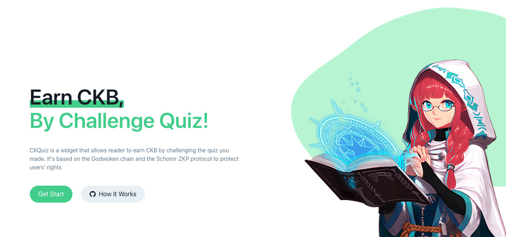

# CKQuiz Home

CKQuiz Home 是 CKQuiz的LandingPage界面，简单介绍CKQuiz的用途与特色。

 

# Table of contents

- [Contributing](#contributing)
- [License](#license)

# Contributing

[(Back to top)](#table-of-contents)

欢迎贡献代码

在项目目录下输入 `npm run start` 即可启动开发环境。

# License

[(Back to top)](#table-of-contents)

The MIT License (MIT) 2023 - [LiRiu](https://github.com/liriu/).